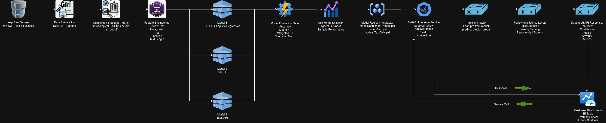

# Yelp Review Intelligence

An end-to-end AI-powered NLP system that transforms unstructured customer reviews into actionable business intelligence for restaurant owners and multi-location restaurant operations teams.

Instead of building only a sentiment classifier, this project demonstrates how a production-ready NLP solution can automatically understand thousands of customer reviews and convert them into structured business insights that can be consumed by dashboards, REST APIs, or future AI assistants.

---

# Highlights

✔ End-to-end NLP Pipeline

✔ Three Different NLP Models Evaluated

- TF-IDF + Logistic Regression
- DistilBERT
- TextCNN

✔ Leakage-safe Data Preparation

✔ Feature Engineering

✔ Hyperparameter Optimization

✔ Cross Validation

✔ Model Comparison & Best Model Selection

✔ Production-ready FastAPI REST API

✔ Dockerized Deployment

✔ Business Intelligence Layer

✔ Dashboard-ready Outputs

✔ Modular OOP Architecture

✔ Centralized Logging

✔ Custom Exception Handling

✔ Configuration-driven Pipeline

✔ Postman Collection Included

---

# Business Problem

Restaurant managers receive hundreds or even thousands of customer reviews every month.

Reading every review individually is impossible, making it difficult to identify recurring operational problems and customer satisfaction trends.

This project automatically transforms raw customer reviews into structured business intelligence by identifying:

- Overall sentiment
- Complaint topics
- Review severity
- Representative customer reviews
- Recommended operational actions

The generated outputs can be directly consumed by:

- BI Dashboards
- Restaurant Managers
- Multi-location Operations Teams
- REST APIs
- Future AI Assistants / Chatbots

---

# System Architecture

The following architecture illustrates the complete production workflow from raw Yelp data to business insights.

The pipeline includes:

- Raw data ingestion
- Leakage-safe preprocessing
- Feature engineering
- Multiple model training
- Model comparison
- Best model selection
- Model registry
- FastAPI inference
- Business intelligence generation
- Dashboard integration

<p align="center">
    
</p>

---

# End-to-End Pipeline

```
Yelp Dataset
      │
      ▼
Data Preparation
      │
      ▼
Leakage-safe Split
      │
      ▼
Feature Engineering
      │
      ▼
Model Training
      │
      ▼
Model Comparison
      │
      ▼
Best Model Selection
      │
      ▼
Model Registry
      │
      ▼
FastAPI REST Service
      │
      ▼
Prediction Layer
      │
      ▼
Business Intelligence Layer
      │
      ▼
Dashboard / BI / Chatbot
```

---

# Model Comparison

Rather than selecting a model upfront, three different NLP approaches were implemented and evaluated.

| Model | Technique | Advantages | Limitations |
|--------|-----------|------------|-------------|
| TF-IDF + Logistic Regression | Classical Machine Learning | Fast, interpretable, lightweight | Limited semantic understanding |
| DistilBERT | Transformer-based Language Model | Context-aware semantic understanding | Slower inference, larger model |
| TextCNN | Deep Learning | Learns local semantic patterns | Longer training time |

Each model was trained and evaluated using exactly the same train/test split and evaluation metrics.

Evaluation metrics include:

- Accuracy
- Precision
- Recall
- Macro F1
- Weighted F1
- Confusion Matrix
- Classification Report

The highest-performing model can be deployed without changing the REST API implementation.

---

# Why Multiple Models?

The objective of this project is not simply to build a sentiment classifier.

Instead, different NLP paradigms were compared under exactly the same business problem.

This enables comparison across:

- Prediction Quality
- Training Time
- Inference Latency
- Deployment Complexity
- Interpretability

This makes the solution production-oriented rather than model-oriented.

---

# Data Preparation

The data preparation pipeline includes:

- Reading Yelp Academic Dataset
- Efficient JSON loading
- DuckDB joins
- Missing value handling
- Chronological train/test split
- Leakage prevention
- Business metadata enrichment
- Tip aggregation
- Feature engineering
- Text preprocessing

---

# Feature Engineering

Multiple feature combinations were evaluated through an ablation study.

Feature sets include:

- Review text only
- Review + business categories
- Review + categories + tips
- Full contextual features

Additional engineered features:

- Review word count
- Character count
- Rating gap
- User experience bucket
- Tip count
- Average tip compliments
- Business location
- Restaurant categories

---

# Model Training Pipeline

The training workflow consists of:

1. Data Preparation
2. Leakage-safe Split
3. Feature Engineering
4. Feature Selection
5. Hyperparameter Optimization
6. Cross Validation
7. Model Training
8. Model Evaluation
9. Model Comparison
10. Best Model Selection
11. Model Serialization

---

# Business Intelligence Layer

Unlike a traditional sentiment classifier, this project generates business-oriented outputs.

For every review the system produces:

- Predicted sentiment
- Prediction confidence
- Complaint topics
- Severity level
- Recommended actions

Business-level outputs include:

- Overall sentiment distribution
- Top complaint topics
- Representative reviews
- Dashboard-ready JSON
- CSV reports

---

# REST API

The selected production model is exposed using FastAPI.

Available endpoints:

| Method | Endpoint | Description |
|----------|----------|-------------|
| GET | /health | Health check |
| GET | /model-info | Model metadata |
| POST | /analyze-review | Analyze a single review |
| POST | /analyze-batch | Analyze multiple reviews |

---

# Production Inference Flow

The deployed REST API never retrains the model.

Instead, it follows this workflow:

Incoming Review

↓

Load Pre-trained Production Model

↓

Text Preprocessing

↓

Prediction (`predict_proba`)

↓

Topic Detection

↓

Severity Estimation

↓

Recommendation Engine

↓

Structured JSON Response

This allows the API to remain lightweight while using the best model selected during training.

---

# Project Structure

```
.
├── architecture/
│   ├── yelp_review_intelligence.drawio
│   └── yelp_review_intelligence.jpg
│
├── collection/
│   └── Yelp-Review-Intelligence-API.postman_collection.json
│
├── configs/
│   └── config.yaml
│
├── data/
│   └── processed/
│
├── logs/
│   └── app.log
│
├── models/
│   ├── sentiment_model.pkl
│   ├── bert_sentiment_model/
│   └── textcnn/
│
├── notebooks/
│   ├── 01_data_preparation.ipynb
│   ├── 02_model_training.ipynb
│   ├── 03_review_intelligence_outputs.ipynb
│   ├── bert_model/
│   └── TextCNN/
│
├── outputs/
│   ├── bert/
│   └── textcnn/
│
├── scripts/
│   ├── prepare_data.py
│   ├── train_model.py
│   └── generate_outputs.py
│
├── src/
│   └── yelp_review_intelligence/
│       ├── api/
│       ├── inference/
│       ├── services/
│       ├── modeling.py
│       ├── intelligence.py
│       ├── data_preparation.py
│       ├── logger.py
│       ├── exceptions.py
│       └── utils.py
│
├── Dockerfile
├── docker-compose.yml
├── requirements.txt
└── README.md
```

---

# Installation

Clone the repository

```bash
git clone https://github.com/eserinanarslan/yelp_review_intelligence.git

cd yelp_review_intelligence
```

Install dependencies

```bash
pip install -r requirements.txt
```

---

# Dataset

Download the Yelp Academic Dataset:

https://www.yelp.com/dataset

Place the following files under

```
yelp_datasets/yelp_dataset/
```

Required files:

- yelp_academic_dataset_review.json
- yelp_academic_dataset_business.json
- yelp_academic_dataset_tip.json

---

# Running the Training Pipeline

```bash
export PYTHONPATH=$PWD/src

python scripts/prepare_data.py --config configs/config.yaml

python scripts/train_model.py --config configs/config.yaml

python scripts/generate_outputs.py --config configs/config.yaml
```

Generated artifacts:

```
models/
outputs/
data/processed/
```

---

# Running the REST API

```bash
export PYTHONPATH=$PWD/src

uvicorn yelp_review_intelligence.api.app:app --reload
```
---

# Docker

Build

```bash
docker compose build
```

Run

```bash
docker compose up
```

---

# Logging

Centralized logging is implemented across the entire application.

Logs are written to

```
logs/app.log
```

---

# Exception Handling

Custom exception classes are implemented for:

- Configuration
- Data Preparation
- Model Training
- Model Loading
- Prediction
- Business Intelligence
- API

---

# Leakage Prevention

The pipeline explicitly prevents information leakage by:

- Chronological train/test split
- Historical tip aggregation
- No future information during feature engineering
- Separate training and inference pipelines

---

# Example Business Use Cases

The generated business intelligence can support:

- Restaurant Managers
- Restaurant Chains
- Customer Experience Teams
- Marketing Teams
- Franchise Operations
- BI Dashboards
- Customer Support Analytics
- AI Assistants

---

# Future Improvements

Possible production extensions include:

- BERTopic
- Sentence Transformers
- LLM-powered Summarization
- RAG-powered Restaurant Assistant
- MLflow Model Registry
- Automated Retraining
- Drift Detection
- Kubernetes Deployment
- CI/CD Pipelines
- Prometheus & Grafana Monitoring
- Authentication & Authorization
- Database Integration

---

# Tech Stack

- Python
- Pandas
- NumPy
- DuckDB
- Scikit-learn
- PyTorch
- Transformers
- FastAPI
- Pydantic
- Docker
- Joblib
- YAML
- Matplotlib

---

# Author

**Eser Inan Arslan**

Senior Data Scientist | Machine Learning Engineer